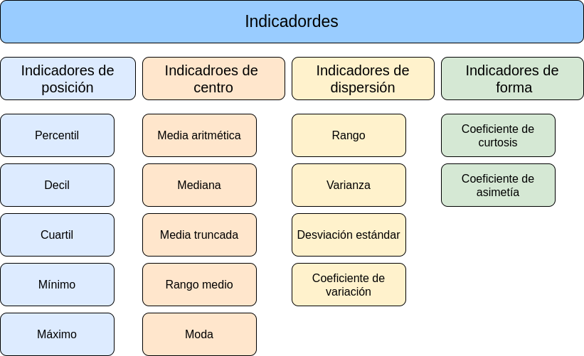

```{r setup, include=FALSE}
library(learnr)
library(summarytools)
library(psych)
knitr::opts_chunk$set(echo = FALSE,
                 exercise.warn_invisible = FALSE)
# colores
c1="#FF7F00" # NARANJA COLOR PRINCIPAL
c2="#034a94" # AZUL FUERTE COLOR SECUNDARIO  
c3="#0eb0c6" # AZUL CLARO COLOR TERCEARIO  
c4="#686868" # GRIS COLOR TEXTO 

```

# **PRESENTACIÓN**

```{r, echo=FALSE, out.width="100%", fig.align = "center"}
knitr::include_graphics("images/banner2.png")
```

El presente tutorial contiene preguntas relacionadas  con el resumen de datos a través de indicadores. A continuación se presentan un resumen  con los principales conceptos:

</br>

## **CONCEPTOS**

Cuando realizamos un análisis datos es necesario el cálculo de indicadores que faciliten su interpretación

</br>

#### **INDICADORES DE POSICIÓN**

Estos indicadores permiten realizar comparaciones de un dato con respecto al grupo. Dentro de ellos se destacan : los percentiles, los deciles, los quintiles, y los cuartiles. Con estos últimos se construye el diagrama de cajas útiles en la detección de datos atípicos.


|Indicador               | fórmula                               | código R                      |
|:-----------------------|:--------------------------------------|:------------------------------|
|$Q_{1}$ percentil 25    |$X_{n \times 0.25}$                    |`quantile(x,0.25)`             |
|$Q_{2}$ percentil 50    |$X_{n \times 0.50}$                    |`quantile(x,0.50)`             |
|$Q_{3}$ percentil 75    |$X_{n \times 0.75}$                    |`quantile(x,0.75)`             |
|rango intercuartílico   |$Q_{3}-Q_{1}$                          |                               |

</br></br>

#### **INDICADORES DE CENTRO**

Los indicadores de centro resumen en un solo número el conjunto de datos. Dentro de ellos se destacan : la media, mediana, la moda, el rango medio y la media truncada. Tambien forman parte de este grupo la media geométrica y la media armónica que se usan en situaciones especiales.

|Indicador               | fórmula                               | código R                      |
|:-----------------------|:--------------------------------------|:------------------------------|
|media aritmética        | $\displaystyle\dfrac{1}{n}\sum_{i=1}^{n} x_{i}$    | `mean(x)`        |
|mediana                 | $Me = P_{50} = X_{n+1/2}$             | `median(x)`                   |
|moda                    | $Mo$ dato que más se repite           |                               |
|media truncada | media calculada con el 90% central de los datos|`mean(x,trim=10/100)`          |
|rango medio             | $rm=\dfrac{min\{x\}-max\{x\}}{2}$     | `max(x)-min(x)`               |
|media geométrica        | $(x_{1} \times x_{2} \times x_{3} .... x_{n})^{1/n}$  |               |
|media armónica          | $\dfrac{n}{\dfrac{1}{x_{1}}+\dfrac{1}{x_{2}}+\dfrac{1}{x_{3}}+...+\dfrac{1}{x_{n}}}$ |  |

</br></br>

#### **INDICADORES DE DISPERSIÓN**

Los indicdores de dispersión conforman un grupo de indicadores que miden la variabilidad de los datos, caracteristica centro de la Estadística. Los principales indicadores de dispersión son : el rango, la varianza, la desviación estandar y el coeficiente de variación.


|Indicador               | fórmula                          library(paqueteMET)
data("CarreraLuz22")     | código R                      |
|:-----------------------|:--------------------------------------|:------------------------------|
|rango                   |$r= max\{x\}-min\{x\}$                 |`max(x)-min(x)`                |
|varianza                |$s^{2} = \dfrac{1}{n-1} \displaystyle\sum_{i=1}^{n}(x_{i}-\bar{x})^{2}$  |`var(x)` 
|desviación estandar     |$s = \sqrt{s^{2}}$                     |`sd(x)`                        |
|coeficiente de variación|$cv= \dfrac{s}{\bar{x}} \times 100$ %  |`sd(x)/mean(x)*100`            |

</br></br>

#### **INDICADORES DE FORMA**

Los indicadores de forma permiten analizar los datos respecto a su distribución que tiene dos dimensiones : el apuntamiento o curtosis y la asimetria o sesgo.

|Indicador               | fórmula                               | código R                      |
|:-----------------------|:--------------------------------------|:------------------------------|
|coeficiente de curtosis |$\displaystyle\dfrac{Q_{3}-Q_{1}}{P_{90}-P_{10}}$ |`rapportools::kurtosis(bpe$promedio)`|
|coeficiente de asimetría|$\displaystyle\dfrac{3(\bar{x}-Me)}{s}$|`rapportools::skewness(bpe$promedio)`|


Las siguientes funciones permiten un un conjunto de indicadores :

* `summary(x)`
* `summarytools::descr(x)`
* `psych::describe(x)`

</br></br>

### **MAPA** 

```{r, echo=FALSE, , out.width="100%", fig.align = "center"}
  

```

## **CUESTIONARIO**

### **Pregunta 1**

```{r quiz_1}

quiz(
  question("En un conjunto de 26 valores de una variable aumentamos 5 unidades a los 3 valores más altos. Entonces no varía:", 
           correct = "Correcto !, la mediana se  mentiene igual, aunque varien datos en los extremos.", 
           allow_retry = TRUE,
           answer("La media aritmética", message = "No, pero intentalo de nuevo!"),
           answer("El percentil 98", message = "No...intentalo de nuevo!"),
           answer("La mediana",  correct = TRUE), 
           answer("El percentil 95",message = "Incorrecto. Intenta de nuevo!."),
           # Si no cambiamos estos textos en los botones, se mostrarán en Inglés  
           submit_button = "Enviar respuesta",
           try_again_button = "Intentar de nuevo"),
  # Si no ponemos un caption aparecerá la palabra Quiz en inglés.
  caption = " "
)

```


### **Pregunta 2**

```{r quiz_2}

quiz(
  question("Si a todos los valores de una variable les sumamos una constante positiva m entonces :", 
           correct = "Correcto!.", 
           allow_retry = TRUE,
           answer("La nueva media aumenta en esa constante m", correct = TRUE),
           answer("La nueva media disminuye en esa constante m", message = "No...intentalo de nuevo!"),
           answer("La nueva media queda multiplicada por esa constante m", message = "Incorrecto. Intenta de nuevo!."),
           answer("La nueva media no varia", message = "No, pero intentalo de nuevo!"),
           # Si no cambiamos estos textos en los botones, se mostrarán en Inglés  
           submit_button = "Enviar respuesta",
           try_again_button = "Intentar de nuevo"),
  # Si no ponemos un caption aparecerá la palabra Quiz en inglés.
  caption = " "
)

```


### **Pregunta 3**

```{r quiz_3}

quiz(
  question("Al mirar las notas de Estadística observas que de los 120 alumnos de la lista sólo te superan en nota 14. Puedes decir con razón que:", 
           correct = "Correcto!. 14/120 = 0.116, lo cual indica que solo te supera el 11.6% y tu posición corresponde al percentil  88.4.", 
           allow_retry = TRUE,
           answer("He superado el noveno decil", message = "Cerca, pero no...intentalo de nuevo!"),
           answer("Mi nota es el percentil 91", message = "No...intentalo de nuevo!"),
           answer("He superado el percentil 85", correct = TRUE),
           answer("Ninguna de las anteriores", message = "Incorrecto. Intenta de nuevo!."),
           # Si no cambiamos estos textos en los botones, se mostrarán en Inglés  
           submit_button = "Enviar respuesta",
           try_again_button = "Intentar de nuevo"),
  # Si no ponemos un caption aparecerá la palabra Quiz en inglés.
  caption = " "
)

```

### **Pregunta 4**

```{r quiz_4}

quiz(
  question("En una muestra de n=15 valores, se cambia el número más pequeño de 12.9 a 1.29. No es corecto afirmar que :", 
           correct = "Correcto!. la mediana es robusta a cambios en los datos extremos.", 
           allow_retry = TRUE,
           answer("Cambia el valor de la varianza de los datos", message = "Cerca, pero no...intentalo de nuevo!"),
           answer("Cambia el valor del rango de los datos", message = "No...intentalo de nuevo!"),
           answer("Cambia la media de los datos", message = "Incorrecto. Intenta de nuevo!."),
           answer("Cambia la mediana de los datos", correct = TRUE),
           # Si no cambiamos estos textos en los botones, se mostrarán en Inglés  
           submit_button = "Enviar respuesta",
           try_again_button = "Intentar de nuevo"),
  # Si no ponemos un caption aparecerá la palabra Quiz en inglés.
  caption = " "
)

```


### **Pregunta 5**

```{r quiz_5}

quiz(
  question("Si a todos los valores de una variable les sumamos una constante positiva m entonces:", 
           correct = "Correcto!, por propiedades de la varianza V(X+m)= V(X)+0", 
           allow_retry = TRUE,
           answer("La nueva varianza aumenta en esa constante m", message = "Cerca, pero no...intentalo de nuevo!"),
           answer("La nueva varianza disminuye en esa constante m", message = "No...intentalo de nuevo!"),
           answer("La nueva varianza queda multiplicada por esa constante m", message = "Incorrecto. Intenta de nuevo!."),
           answer("La nueva varianza no varia", correct = TRUE),
           # Si no cambiamos estos textos en los botones, se mostrarán en Inglés  
           submit_button = "Enviar respuesta",
           try_again_button = "Intentar de nuevo"),
  # Si no ponemos un caption aparecerá la palabra Quiz en inglés.
  caption = " "
)

```


### **Pregunta 6**

```{r quiz_6}

quiz(
  question("La desviación estandar", 
           correct = "Correcto !.", 
           allow_retry = TRUE,
           answer("Es un indicador de variabilidad de los datos", correct = TRUE),
           answer("Es un indicador de tendencia central", message = "No...intentalo de nuevo!"),
           answer("Es un indicador de posición de los datos", message = "Incorrecto. Intenta de nuevo!."),
           answer("Es un indicador de forma de los datos", message = "No.....intentalo de nuevo!"),
           # Si no cambiamos estos textos en los botones, se mostrarán en Inglés  
           submit_button = "Enviar respuesta",
           try_again_button = "Intentar de nuevo"),
  # Si no ponemos un caption aparecerá la palabra Quiz en inglés.
  caption = " "
)

```


### **Pregunta 7**

```{r quiz_7}

quiz(
  question("Un vendedor debe converit los pesos de los paquetes de ofrece de libras a kilogramos (1 kg = 2.2 lb)", 
           correct = "Correcto!, por propiedad de la varianza al multiplicar todos los datos por 2.2 el valor de la varianza se ve multiplocado por 2.2 al cuadrado .", 
           allow_retry = TRUE,
           answer("La varianza de los pesos permanece igual al ser medida en libras o en kilogramos", message = "Cerca, pero no...intentalo de nuevo!"),
           answer("La varianza de los pesos aumenta en 2.2  al pasar los pesos de kilogramos a libras", message = "No...intentalo de nuevo!"),
           answer("La varianza de los pesos disminuye en 2.2 al pasar los pesos de kilogramos a libras", message = "Incorrecto. Intenta de nuevo!."),
           answer("La varianza de los pesos se multiploca por 2.2 al cuadrado al pasar los pesos de kilogramos a libras", correct = TRUE),
           # Si no cambiamos estos textos en los botones, se mostrarán en Inglés  
           submit_button = "Enviar respuesta",
           try_again_button = "Intentar de nuevo"),
  # Si no ponemos un caption aparecerá la palabra Quiz en inglés.
  caption = " "
)

```


### **Pregunta 8**

```{r quiz_8}

quiz(
  question("Suponga que al medir el coeficiente de variación de una muestra, inca un valor del 50%. Esto nos indica claramente que: ", 
           correct = "Respuesta y explicación!, .", 
           allow_retry = TRUE,
           answer("Los datos son simetricos", message = "Cerca, pero no...intentalo de nuevo!"),
           answer("La varianza es pequeña", message = "No...intentalo de nuevo!"),
           answer("Los datos presentan un alto grado de variabilidad", correct = TRUE),
           answer("Los datos presenhtan un pequeño sesgo a la derecha", message = "Incorrecto. Intenta de nuevo!."),
           # Si no cambiamos estos textos en los botones, se mostrarán en Inglés  
           submit_button = "Enviar respuesta",
           try_again_button = "Intentar de nuevo"),
  # Si no ponemos un caption aparecerá la palabra Quiz en inglés.
  caption = " "
)

```


### **Pregunta 9**

```{r quiz_9}

quiz(
  question("Suponga al examinar una muestra, se encuentra que el coeficiente de asimetria tiene un valor de 1. Esto indicaria que:", 
           correct = "Correcto!, cuando el valor del coeficiente de asimetria toma valores positivos, indica que la forma de los datos es asimetrica positiva, presentado una mayor concentración de datos en su parte izquierda y por tanto la mediana es menor que la media.", 
           allow_retry = TRUE,
           answer("La media y la mediana son iguales", message = "Cerca, pero no...intentalo de nuevo!"),
           answer("La media y la mediana son levemente diferentes", message = "No...intentalo de nuevo!"),
           answer("La media es menor que la mediana", message = "Incorrecto. Intenta de nuevo!."),
           answer("La mediana es menor que la media", correct = TRUE),
           # Si no cambiamos estos textos en los botones, se mostrarán en Inglés  
           submit_button = "Enviar respuesta",
           try_again_button = "Intentar de nuevo"),
  # Si no ponemos un caption aparecerá la palabra Quiz en inglés.
  caption = " "
)

```


### **Pregunta 10**

```{r quiz_10}

quiz(
  question("Cuando la distribución de los datos tiene una forma sesgada a la izquierda, el mejor indicador de centro que los representa es:", 
           correct = "Correcto!.", 
           allow_retry = TRUE,
           answer("La media", message = "Cerca, pero no...intentalo de nuevo!"),
           answer("La mediana", correct = TRUE),
           answer("El rango medio", message = "Incorrecto. Intenta de nuevo!."),
           answer("La moda", message = "No...intentalo de nuevo!"),
           # Si no cambiamos estos textos en los botones, se mostrarán en Inglés  
           submit_button = "Enviar respuesta",
           try_again_button = "Intentar de nuevo"),
  # Si no ponemos un caption aparecerá la palabra Quiz en inglés.
  caption = " "
)

```


## **PROBLEMAS**

### **Problema 1**

El paquete paqueteMET contiene información de los tiempo obtenidos por 1922 atletas que participaron en la carrera de La Luz en 2022 en Cali. 

|id    |sex      |edad  |origen    |timerun  |categoria           |nacionalidad  |
|:-----|:--------|:-----|:---------|:--------|:-------------------|:-------------|
|1     |Hombre   |22    |Sevilla   |1988     |2. Abierta          |COL           |
|2     |Hombre   |31    |Sevilla   |2041     |2. Abierta          |COL           |
|3     |Hombre   |31    |Yumbo     |2083     |2. Abierta          |COL           |
|4     |Hombre   |36    |Cali      |2112     |2. Abierta          |COL           |
|5     |Hombre   |32    |Cali      |2213     |2. Abierta          |COL           |
|6     |Hombre   |48    |Palmira   |2238     |3. Veteranos A      |COL           |

* **sex** : sexo del atleta : Hombre, Mujer 
* **edad**: edad en años del atleta
* **origen**: Ciudad de origen
* **timerum**: tiempo de carrera en segundos
* **categoría**: 1. Juvenil, 2. Abierta, 3. Veteranos A, 4. Veteranos B, 5. Veteranos C
* **nacionalidad**: nacionalidad del atleta

Calcule los indicadores de centro para el tiempo de carrera de todos los participantes en minutos

**Nota**: para cargar la data se requiere descargar y activar el paquete `paqueteMET` y la función `data(CarreraLuz22)`

```{r p1, exercise=TRUE, exercise.lines = 20}
library(paqueteMET)
data("CarreraLuz22")

```


```{r p1-hint}
# Indicadores de centro
mean(x)
median(x)
(min(x)+max(x))/2
mean(x, 0.10)

```


```{r p1-solution}
# Indicadores de centro
library(paqueteMET)
data("CarreraLuz22")
x=CarreraLuz22$timerun/60
mean(x)            # media
median(x)          # mediana
(min(x)+max(x))/2  # rango medio
mean(x, 0.10)      # media truncada
```


### **Problema 2**

El paquete paqueteMET contiene información de los tiempo obtenidos por 1922 atletas que participaron en la carrera de La Luz en 2022 en Cali. 

* **sex** : sexo del atleta : Hombre, Mujer 
* **edad**: edad en años del atleta
* **origen**: Ciudad de origen
* **timerum**: tiempo de carrera en segundos
* **categoría**: 1. Juvenil, 2. Abierta, 3. Veteranos A, 4. Veteranos B, 5. Veteranos C
* **nacionalidad**: nacionalidad del atleta

Se requiere saber si en promedio los hombre de la categoria `3. Veteranos A` registraron menor tiempo que las mujeres en la categoria `2. Abierta` 

```{r p2, exercise=TRUE, exercise.lines = 20}
library(paqueteMET)
data("CarreraLuz22")

```


```{r p2-hint}
library(paqueteMET)
data("CarreraLuz22")
data1=subset(CarreraLuz22, CarreraLuz22$sex=="Hombre" & CarreraLuz22$categoria=="3. Veteranos A")
data2=subset(CarreraLuz22, CarreraLuz22$sex=="Mujer" & CarreraLuz22$categoria=="2. Abierta")

```


```{r p2-solution}
library(paqueteMET)
data("CarreraLuz22")
data1=subset(CarreraLuz22, CarreraLuz22$sex=="Hombre" & CarreraLuz22$categoria=="3. Veteranos A")
data2=subset(CarreraLuz22, CarreraLuz22$sex=="Mujer" & CarreraLuz22$categoria=="2. Abierta")
mean(data1$timerun/60)
mean(data2$timerun/60)
```


### **Problema 3**

El paquete paqueteMET contiene información de los tiempo obtenidos por 1922 atletas que participaron en la carrera de La Luz en 2022 en Cali. 

* **sex** : sexo del atleta : Hombre, Mujer 
* **edad**: edad en años del atleta
* **origen**: Ciudad de origen
* **timerum**: tiempo de carrera en segundos
* **categoría**: 1. Juvenil, 2. Abuerta, 3. Veteranos A, 4. Veteranos B, 5. Veteranos C
* **nacionalidad**: nacionalidad del atleta

Determine si la distribución de las edades de los atletas mujeres es simetrica


```{r p3, exercise=TRUE, exercise.lines = 20}
library(paqueteMET)
data("CarreraLuz22")

```


```{r p3-hint}
library(paqueteMET)
data("CarreraLuz22")
data2=subset(CarreraLuz22, CarreraLuz22$sex=="Mujer")

```


```{r p3-solution}
library(paqueteMET)
data("CarreraLuz22")
data3=subset(CarreraLuz22, CarreraLuz22$sex=="Mujer")
# forma 1 : si la media y la mediana son similares, entonces la forma es simetrica
#           si la media es menor que la mediana, entonces la forma es asimetrica negativa - muchas con mucha edad
#           si la media es mayor que la mediana, entonces la forma es asimetrica positiva - muchas con poca edad
median(data3$edad)
mean(data3$edad)

# forma 2
#library(rapportools)
rapportools::skewness(data3$edad, na.rm = TRUE) 
```


### **Problema 4**

El paquete paqueteMET contiene información de los tiempo obtenidos por 1922 atletas que participaron en la carrera de La Luz en 2022 en Cali. 

* **sex** : sexo del atleta : Hombre, Mujer 
* **edad**: edad en años del atleta
* **origen**: Ciudad de origen
* **timerum**: tiempo de carrera en segundos
* **categoría**: 1. Juvenil, 2. Abierta, 3. Veteranos A, 4. Veteranos B, 5. Veteranos C
* **nacionalidad**: nacionalidad del atleta

Ahora se requiere calcular las medias para todas las categoria en hombre y en mujeres

```{r p4, exercise=TRUE, exercise.lines = 15}
library(paqueteMET)
data("CarreraLuz22")

```


```{r p4-hint}
library(paqueteMET)
data("CarreraLuz22")
data4M=subset(CarreraLuz22, CarreraLuz22$sex=="Mujer")
data4H=subset(CarreraLuz22, CarreraLuz22$sex=="Hombre")

```


```{r p4-solution}
library(paqueteMET)
data("CarreraLuz22")
data4M=subset(CarreraLuz22, CarreraLuz22$sex=="Mujer")
data4H=subset(CarreraLuz22, CarreraLuz22$sex=="Hombre")

tM =stats::aggregate(data4M$timerun/60, list(data4M$categoria), FUN=mean) 
colnames(tM)=c("Categoría-mujeres", "media")
tM

tH = stats::aggregate(data4H$timerun/60, list(data4H$categoria), FUN=mean) 
colnames(tH)=c("Categoría-hombres", "media")
tH
```


### **Problema 5**

El paquete paqueteMET contiene información de los tiempo obtenidos por 1922 atletas que participaron en la carrera de La Luz en 2022 en Cali. 

* **sex** : sexo del atleta : Hombre, Mujer 
* **edad**: edad en años del atleta
* **origen**: Ciudad de origen
* **timerum**: tiempo de carrera en segundos
* **categoría**: 1. Juvenil, 2. Abierta, 3. Veteranos A, 4. Veteranos B, 5. Veteranos C
* **nacionalidad**: nacionalidad del atleta

Que diferencias existe entre las funciones:

* summary(x)
* summarytools::descr()
* psych::describe()


```{r p5, exercise=TRUE, exercise.lines = 20}
library(paqueteMET)
data("CarreraLuz22")

```


```{r p5-hint}
library(paqueteMET)
data("CarreraLuz22")
x=CarreraLuz22$edad
summary(x)                

```


```{r p5-solution}
library(paqueteMET)
data("CarreraLuz22")
x=CarreraLuz22$edad
summary(x)                # resumen rapido de indicadores, no incluye indicadores de dispersión
summarytools::descr(x)    # resumen completo de indicadores de posición, centro, dispersión y forma
psych::describe(x)        # resumen completo de indicadores, incluye el rango
```
